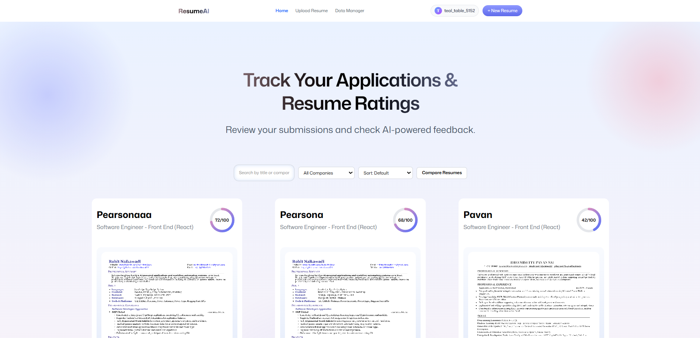
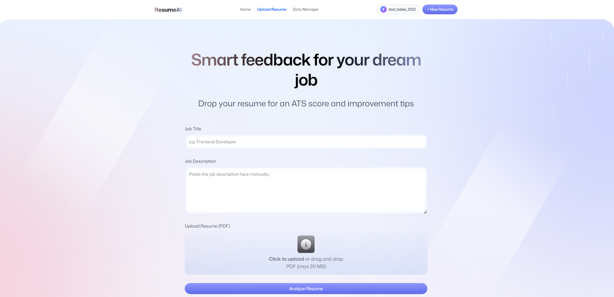
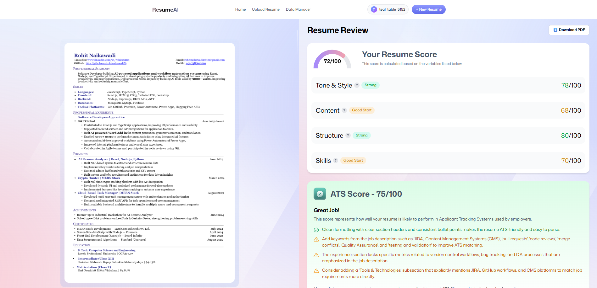
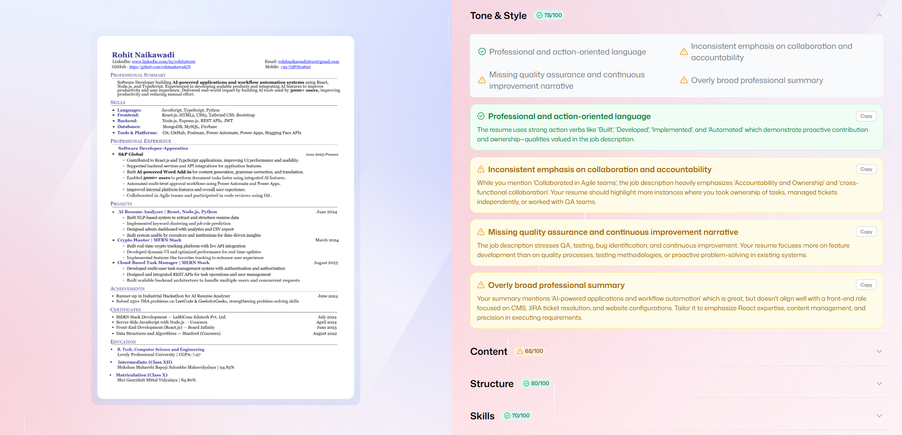

# AI-Powered Resume Analyzer 

AI-Powered Resume Analyzer is a modern web application that leverages AI to analyze resumes, provide ATS (Applicant Tracking System) scores, and deliver actionable feedback to help users improve their job applications. Built with React, TypeScript, Zustand, and powered by Puter.js for authentication, file storage, and AI services.




---


## 🚀 Features

- **AI-Powered Resume Analysis:** Upload your resume and receive detailed feedback on ATS compatibility, tone, content, structure, and skills.
  
   
   
- **ATS Score:** Instantly see how your resume performs against automated screening systems.

   
   
- **Actionable Tips:** Get categorized suggestions for improvement, including specific explanations.
   
   
   
- **Job-Aware Feedback:** Optionally provide job title and description for tailored analysis.
- **Secure File Storage:** All files are managed securely via Puter.js.
- **Authentication:** Sign in/out with Puter.js for a personalized experience.
- **Responsive UI:** Works seamlessly across devices.
- **Data Management:** Wipe all your uploaded data with a single click.

---

## 🛠️ Tech Stack

- **React 19** & **TypeScript**
- **Claude Sonnet 4** AI Model
- **React Router 7** (with SSR support)
- **Vite** for fast development
- **Tailwind CSS** & **tw-animate-css** for styling and animation
- **Zustand** for state management
- **Puter.js** for authentication, file system, AI, and key-value storage
- **pdfjs-dist** for PDF preview and conversion

---

## 📦 Project Structure

```
ai-resume-analyzer/
├── app/
│   ├── components/      # Reusable UI components
│   ├── lib/             # Utility libraries (Puter.js, PDF conversion, etc.)
│   ├── routes/          # Route components (home, upload, resume, auth, wipe)
│   ├── app.css          # Tailwind and custom styles
│   └── root.tsx         # App root and error boundary
├── constants/           # Static data and AI prompt templates
├── public/              # Static assets (images, icons, pdf worker)
├── types/               # TypeScript type definitions
├── .react-router/       # React Router build artifacts
├── package.json         # Project scripts and dependencies
├── vite.config.ts       # Vite configuration
└── README.md            # This file
```

---

## ⚡ Quick Start

### Prerequisites

- [Node.js 20+](https://nodejs.org/)
- [npm](https://www.npmjs.com/)

### Installation

1. **Clone the repository:**
   ```sh
   git clone https://github.com/yourusername/AI-Powered-Resume-Analyzer.git
   cd ai-resume-analyzer
   ```

2. **Install dependencies:**
   ```sh
   npm install
   ```

3. **Run the development server:**
   ```sh
   npm run dev
   ```

4. **Open in your browser:**
   ```
   http://localhost:5173
   ```

### Build for Production

```sh
npm run build
```

### Start Production Server

```sh
npm run start
```

---

## 📝 Usage

1. **Sign In:** Log in using Puter.js authentication.
2. **Upload Resume:** Go to "Upload Resume", fill in job details, and upload your PDF.
3. **Analyze:** Wait for the AI to process your resume and generate feedback.
4. **Review Feedback:** View ATS score, detailed tips, and download your resume preview.
5. **Manage Data:** Use the "Wipe App Data" page to delete all your uploaded files and feedback.

---

## 📂 Assets & Resources

- **PDF Worker:** [public/pdf.worker.min.mjs](public/pdf.worker.min.mjs) is required for PDF preview.
- **Icons:** [public/icons/](public/icons/)
- **Images:** [public/images/](public/images/)

---

## 🤖 AI Response Format

The AI feedback is structured as a [`Feedback`](types/index.d.ts) object, with scores and categorized tips for ATS, tone, content, structure, and skills. See [constants/index.ts](constants/index.ts) for the full format and prompt instructions.

---

## 🧑‍💻 Contributing

1. Fork the repository
2. Create your feature branch (`git checkout -b feature/your-feature`)
3. Commit your changes (`git commit -am 'Add new feature'`)
4. Push to the branch (`git push origin feature/your-feature`)
5. Open a Pull Request

---

## 🙋 More Resources

- [Puter.js Documentation](https://puter.com/docs)
- [React Router Docs](https://reactrouter.com/)
